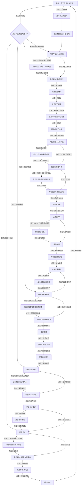
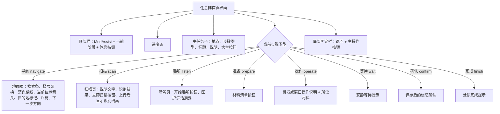
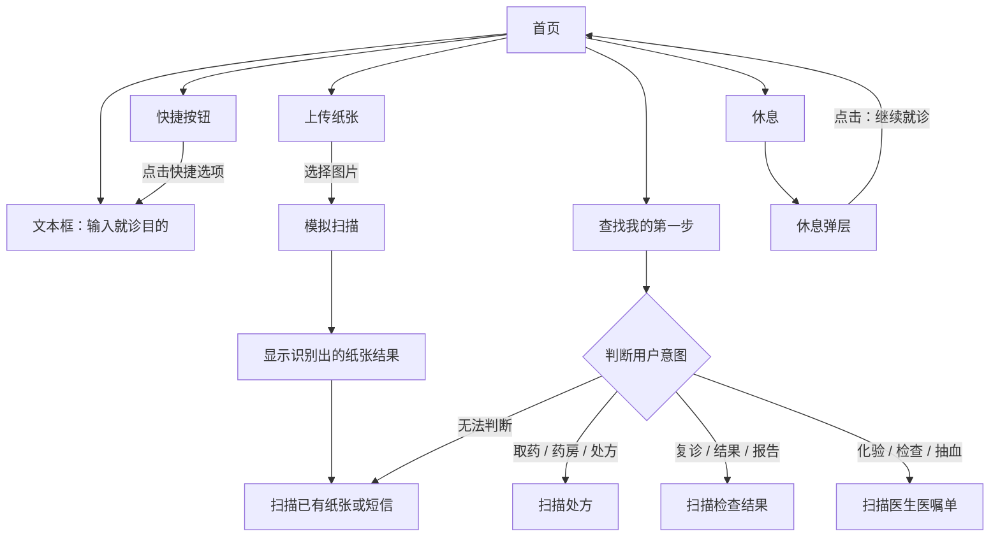
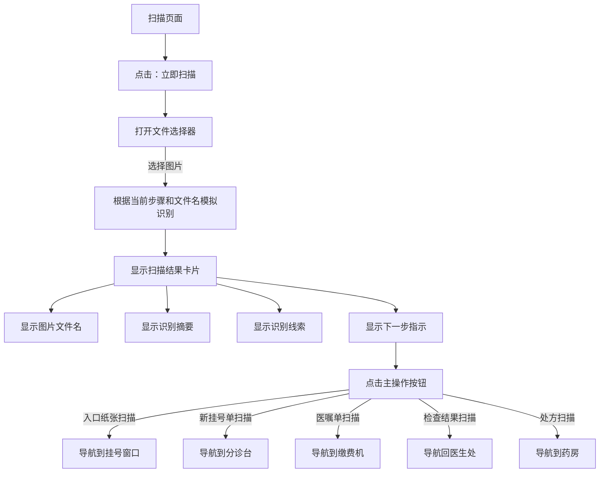
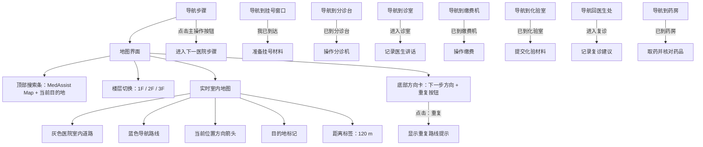
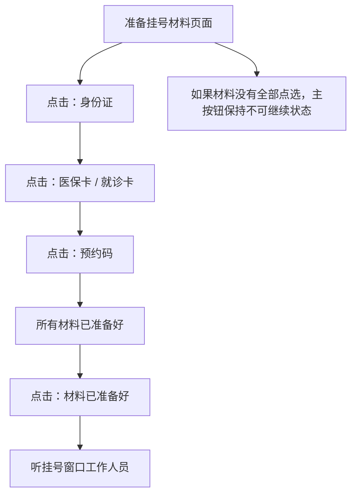
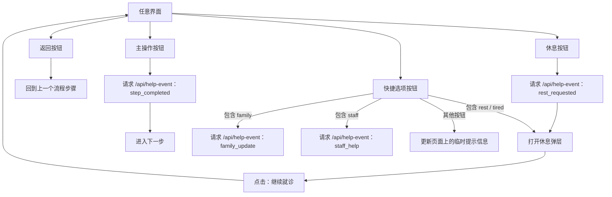

# MedAssist Mobile 中文流程图

## 1. 患者主流程图

```mermaid
flowchart TD
  A[首页：今天为什么来医院？] -->|输入就诊目的| B{点击：查找我的第一步}
  A -->|点击：上传纸张| C[选择并上传图片]
  C --> D[显示模拟扫描识别结果]
  D --> E[扫描已有纸张或短信]

  B -->|取药 / 药房 / 处方| RX[扫描处方]
  B -->|复诊 / 结果 / 报告| LR[扫描检查结果]
  B -->|化验 / 检查 / 抽血| DO[扫描医生医嘱单]
  B -->|无法判断或普通挂号| E

  E -->|点击：立即扫描并上传图片| E1[显示科室、楼层、分诊线索]
  E1 -->|点击：确认目的地| NR[导航到挂号窗口]
  E -->|点击：确认目的地| NR

  NR[导航到 1F 挂号窗口] -->|点击：我已到达| PR[准备挂号材料]
  PR -->|点击：身份证| PR1[身份证已准备]
  PR1 -->|点击：医保卡 / 就诊卡| PR2[医保卡 / 就诊卡已准备]
  PR2 -->|点击：预约码| PR3[所有材料已准备]
  PR3 -->|点击：材料已准备好| SR[听挂号窗口工作人员]

  SR -->|点击：开始聆听| SR1[显示工作人员讲话摘要]
  SR1 -->|点击：工作人员说完了| SRS[扫描新的挂号单]
  SR -->|点击：工作人员说完了| SRS

  SRS -->|点击：立即扫描并上传图片| SRS1[显示分诊位置和排队线索]
  SRS1 -->|点击：去分诊| NT[导航到分诊台]
  SRS -->|点击：去分诊| NT

  NT[导航到 3F 西侧分诊台] -->|点击：已到分诊台| OTM[操作分诊机]
  OTM -->|点击：排队号已打印| RQ[记录排队号]
  RQ -->|点击 A128 / 扫描票据 / 我忘了| RQ1[保存排队信息]
  RQ1 -->|点击：开始等待| WC[等待叫号]
  RQ -->|点击：开始等待| WC

  WC -->|点击：模拟已叫号| NDR[导航到诊室]
  NDR[导航到 318 诊室] -->|点击：进入诊室| DR[记录医生讲话]
  DR -->|点击：开始聆听| DR1[显示医生任务摘要]
  DR1 -->|点击：医生说完了| DO
  DR -->|点击：医生说完了| DO

  DO -->|点击：立即扫描并上传图片| DO1[识别到抽血检查和缴费要求]
  DO1 -->|点击：规划化验路线| NP[导航到缴费机]
  DO -->|点击：规划化验路线| NP

  NP[导航到自助缴费机 B] -->|点击：已到缴费机| OP[操作缴费]
  OP -->|点击：缴费完成| NL[导航到化验室]
  NL[导航到 2F 化验室] -->|点击：已到化验室| LS[提交化验材料]
  LS -->|点击：采样完成| LR

  LR -->|点击：立即扫描并上传图片| LR1[识别到检查结果已出]
  LR1 -->|点击：返回医生处| NRD[导航回诊室]
  LR -->|点击：返回医生处| NRD

  NRD[导航回 318 诊室] -->|点击：进入复诊| FR[记录复诊建议]
  FR -->|点击：开始聆听| FR1[显示复诊建议]
  FR1 -->|点击：医生说完了| RX
  FR -->|点击：医生说完了| RX

  RX -->|点击：立即扫描并上传图片| RX1[识别药房窗口和取药号]
  RX1 -->|点击：去药房| NPH[导航到药房]
  RX -->|点击：去药房| NPH

  NPH[导航到 2F 药房 5 号窗口] -->|点击：已到药房| PP[取药并核对药品]
  PP -->|点击：已收到药品| F[就诊完成]
  F -->|点击：重新开始| A
```

## 2. 每个非首页界面的结构

```mermaid
flowchart TD
  Screen[任意非首页界面] --> Header[顶部栏：MedAssist + 当前阶段 + 休息按钮]
  Screen --> Progress[进度条]
  Screen --> TaskCard[主任务卡：地点、步骤类型、标题、说明、大主按钮]
  Screen --> Body{当前步骤类型}
  Screen --> Footer[底部固定栏：返回 + 主操作按钮]

  Body -->|导航 navigate| Map[地图页：搜索条、楼层切换、蓝色路线、当前位置箭头、目的地标记、距离、下一步方向]
  Body -->|扫描 scan| Scan[扫描页：说明文字、识别结果、立即扫描按钮、上传后显示识别线索]
  Body -->|聆听 listen| Listen[聆听页：开始聆听按钮、医护讲话摘要]
  Body -->|准备 prepare| Materials[材料清单按钮]
  Body -->|操作 operate| Operate[机器或窗口操作说明 + 所需材料]
  Body -->|等待 wait| Wait[安静等待提示]
  Body -->|确认 confirm| Confirm[保存后的信息确认]
  Body -->|完成 finish| Done[就诊完成提示]
```

## 3. 首页流程图

```mermaid
flowchart TD
  H[首页] --> T[文本框：输入就诊目的]
  H --> Q[快捷按钮]
  H --> U[上传纸张]
  H --> P[查找我的第一步]
  H --> R[休息]

  Q -->|点击快捷选项| T
  U -->|选择图片| SI[模拟扫描]
  SI --> SR[显示识别出的纸张结果]
  SR --> DFP[扫描已有纸张或短信]

  P --> D{判断用户意图}
  D -->|取药 / 药房 / 处方| SP[扫描处方]
  D -->|复诊 / 结果 / 报告| SL[扫描检查结果]
  D -->|化验 / 检查 / 抽血| SD[扫描医生医嘱单]
  D -->|无法判断| DFP

  R --> Rest[休息弹层]
  Rest -->|点击：继续就诊| H
```

## 4. 扫描图片交互流程图

```mermaid
flowchart TD
  S[扫描页面] --> SN[点击：立即扫描]
  SN --> FS[打开文件选择器]
  FS -->|选择图片| SIM[根据当前步骤和文件名模拟识别]
  SIM --> RES[显示扫描结果卡片]
  RES --> FN[显示图片文件名]
  RES --> SUM[显示识别摘要]
  RES --> CLUES[显示识别线索]
  RES --> INST[显示下一步指示]
  INST --> PA[点击主操作按钮]

  PA -->|入口纸张扫描| NR[导航到挂号窗口]
  PA -->|新挂号单扫描| NT[导航到分诊台]
  PA -->|医嘱单扫描| NP[导航到缴费机]
  PA -->|检查结果扫描| NRD[导航回医生处]
  PA -->|处方扫描| NPH[导航到药房]
```

## 5. 地图 / 导航流程图

```mermaid
flowchart TD
  N[导航步骤] --> M[地图界面]
  M --> SB[顶部搜索条：MedAssist Map + 当前目的地]
  M --> FS[楼层切换：1F / 2F / 3F]
  M --> LM[实时室内地图]
  LM --> Road[灰色医院室内道路]
  LM --> Route[蓝色导航路线]
  LM --> Arrow[当前位置方向箭头]
  LM --> Pin[目的地标记]
  LM --> Dist[距离标签：120 m]
  M --> TC[底部方向卡：下一步方向 + 重复按钮]

  TC -->|点击：重复| RP[显示重复路线提示]
  N -->|点击主操作按钮| Next[进入下一医院步骤]

  NR[导航到挂号窗口] -->|我已到达| PR[准备挂号材料]
  NT[导航到分诊台] -->|已到分诊台| OTM[操作分诊机]
  NDR[导航到诊室] -->|进入诊室| DR[记录医生讲话]
  NP[导航到缴费机] -->|已到缴费机| OP[操作缴费]
  NL[导航到化验室] -->|已到化验室| LS[提交化验材料]
  NRD[导航回医生处] -->|进入复诊| FR[记录复诊建议]
  NPH[导航到药房] -->|已到药房| PP[取药并核对药品]
```

## 6. 准备材料流程图

```mermaid
flowchart TD
  P[准备挂号材料页面] --> ID[点击：身份证]
  ID --> MC[点击：医保卡 / 就诊卡]
  MC --> AC[点击：预约码]
  AC --> READY[所有材料已准备好]
  READY --> NEXT[点击：材料已准备好]
  NEXT --> SR[听挂号窗口工作人员]

  P --> BLOCKED[如果材料没有全部点选，主按钮保持不可继续状态]
```

## 7. 全局按钮和副作用流程图

```mermaid
flowchart TD
  Any[任意界面] --> RestBtn[休息按钮]
  RestBtn --> LogRest[请求 /api/help-event：rest_requested]
  LogRest --> RestSheet[打开休息弹层]
  RestSheet --> Resume[点击：继续就诊]
  Resume --> Any

  Any --> Back[返回按钮]
  Back --> Prev[回到上一个流程步骤]

  Any --> Primary[主操作按钮]
  Primary --> LogComplete[请求 /api/help-event：step_completed]
  LogComplete --> NextStep[进入下一步]

  Any --> Quick[快捷选项按钮]
  Quick -->|包含 rest / tired| RestSheet
  Quick -->|包含 family| FamilyLog[请求 /api/help-event：family_update]
  Quick -->|包含 staff| StaffLog[请求 /api/help-event：staff_help]
  Quick -->|其他按钮| Captured[更新页面上的临时提示信息]
```

## 8. 完整步骤顺序图

```mermaid
flowchart LR
  A[首页：输入就诊目的] --> B[扫描已有纸张或短信] --> C[导航到挂号窗口] --> D[准备挂号材料] --> E[听挂号窗口工作人员] --> F[扫描新的挂号单] --> G[导航到分诊台] --> H[操作分诊机] --> I[记录排队号] --> J[等待叫号] --> K[导航到诊室] --> L[记录医生讲话] --> M[扫描医生医嘱单] --> N[导航到缴费机] --> O[操作缴费] --> P[导航到化验室] --> Q[提交化验材料] --> R[扫描检查结果] --> S[导航回医生处] --> T[记录复诊建议] --> U[扫描处方] --> V[导航到药房] --> W[取药并核对药品] --> X[就诊完成] --> A
```
